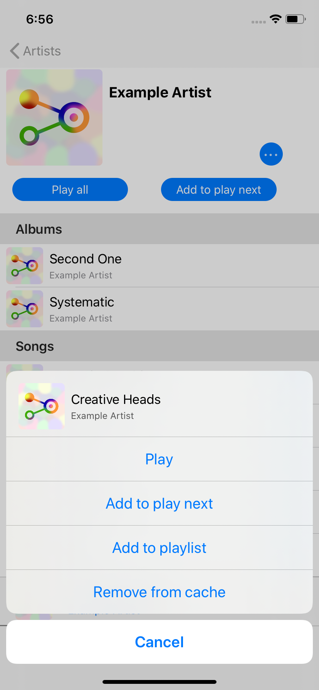
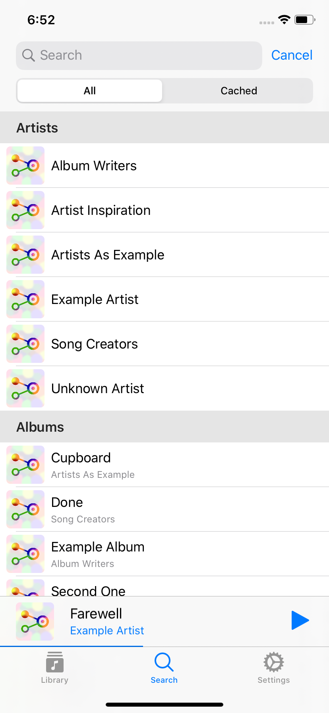
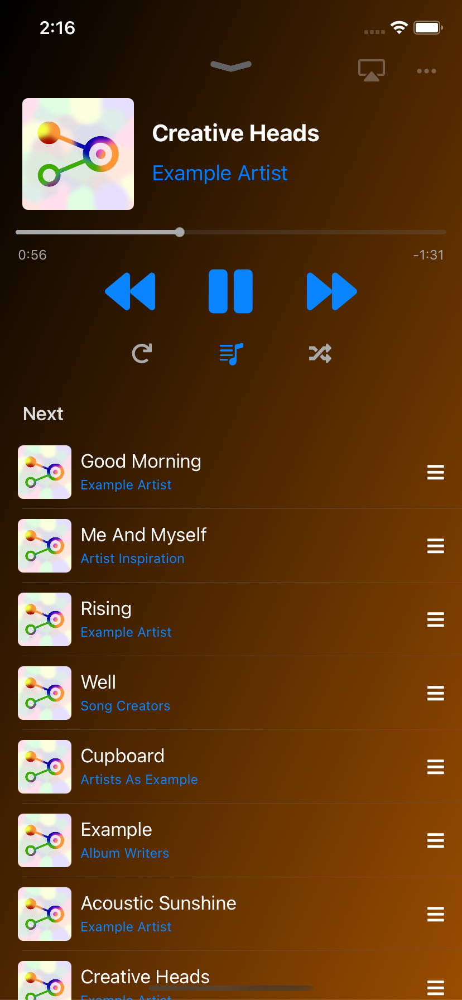

#  Amperfy

## Basics

Amperfy is an iOS app written in Swift to interact with an [Ampache](http://ampache.github.io) or [Subsonic](http://www.subsonic.org) server.

 &nbsp;
 &nbsp;


## Features

- Offline support
- Syncing the database after first login
- Background sync to keep database up to date
- Player interaction from lock screen
- Remote controlable
- Artwork sync from database
- Playlist download and upload

## Requirements

* XCode 10, swift 5.0

## Getting Started

1. Check out the latest version of the project:
  ```
  git clone https://github.com/bleeez/amperfy.git
  ```

2. In the Amperfy directory, check out the project's dependencies:
  ```
  cd amperfy
  git submodule update --init --recursive
  ```

3. Open the `Amperfy.xcodeproj` file.

4. Build and run the "Amperfy" scheme

Attributions
----------------
[LNPopupController](https://github.com/LeoNatan/LNPopupController) by [LeoNatan](https://github.com/LeoNatan) is licensed under [MIT License](https://github.com/LeoNatan/LNPopupController/blob/master/LICENSE)
[Font Awesome Icons](https://fontawesome.com/) by [Font Awesome](https://fontawesome.com/) is licensed under [CC BY 4.0 License](https://creativecommons.org/licenses/by/4.0/)
[Font Awesome Fonts](https://fontawesome.com/) by [Font Awesome](https://fontawesome.com/) is licensed under [SIL OFL 1.1 License](https://scripts.sil.org/OFL)
[iOS 11 Glyphs](https://icons8.com/ios) by [Icons8](https://icons8.com) is licensed under [Good Boy License](https://icons8.com/good-boy-license/)

**License:** [GPLv3](https://github.com/BLeeEZ/Amperfy/blob/master/LICENSE)
