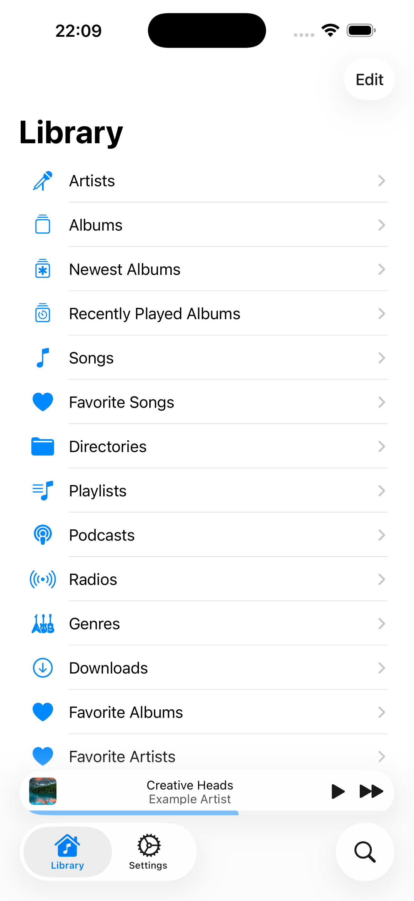

#  Amperfy

## Basics

Amperfy is an iOS/iPadOS/macOS app written in Swift to interact with an [Ampache](http://ampache.github.io) or [Subsonic](http://www.subsonic.org) server.

### iOS

<a href="https://apps.apple.com/app/amperfy-music/id1530145038#?platform=iphone">
  
</a>

 &nbsp;
 &nbsp;


### macOS

<a href="https://apps.apple.com/app/amperfy-music/id1530145038#?platform=mac">
  
</a>


## Features

- Offline support
- Support for music and podcasts
- CarPlay support
- Syncing the database after first login
- Update library in background
- Siri voice commands: "play \<example artist\>"
- Siri shortcuts: play id, search and play
- Player interaction from lock screen
- Sleep timer
- Adjustable playback rate
- Home Screen Quick Actions
- Remote controlable
- Dark mode support

## Requirements

* Xcode 16, Swift 6

## Getting Started

1. Check out the latest version of the project:
  ```
  git clone https://github.com/BLeeEZ/amperfy.git
  cd amperfy
  ```

3. Open the `Amperfy.xcodeproj` file.

4. Build and run the "Amperfy" scheme

  >Real device testing: Amperfy has Apple CarPlay and Siri support. To test it on a real device a developer certificate with granted access to `com.apple.developer.playable-content` and `com.apple.developer.siri` is required. To test Amperfy without Apple CarPlay and Siri clear all entries in `Amperfy/Amperfy.entitlements`.

## Beta test releases

For more information, and to participate in the public beta releases, please visit [Amperfy Beta](https://github.com/BLeeEZ/amperfy/issues/25).

## Contribution

Pull requests are always welcome. Please execute `AmperfyKitTests` to ensure code quality. Running tests will trigger [SwiftFormat](https://github.com/nicklockwood/SwiftFormat) to apply the [Google Swift Style Guide](https://google.github.io/swift), as configured by [Google-SwiftFormat-Config](https://github.com/NoemiRozpara/Google-SwiftFormat-Config). You can also apply the code style manually by executing `./BuildTools/applyFormat.sh`.

## Attributions

- [LNPopupController](https://github.com/LeoNatan/LNPopupController) by [LeoNatan](https://github.com/LeoNatan) is licensed under [MIT License](https://github.com/LeoNatan/LNPopupController/blob/master/LICENSE)
- [MarqueeLabel](https://github.com/cbpowell/MarqueeLabel) by [Charles Powell](https://github.com/cbpowell) is licensed under [MIT License](https://github.com/cbpowell/MarqueeLabel/blob/master/LICENSE)
- [NotificationBanner](https://github.com/Daltron/NotificationBanner) by [Dalton Hinterscher](https://github.com/Daltron) is licensed under [MIT License](https://github.com/Daltron/NotificationBanner/blob/master/LICENSE)
- [ID3TagEditor](https://github.com/chicio/ID3TagEditor) by [Fabrizio Duroni](https://github.com/chicio) is licensed under [MIT License](https://github.com/chicio/ID3TagEditor/blob/master/LICENSE.md)
- [CoreDataMigrationRevised-Example](https://github.com/wibosco/CoreDataMigrationRevised-Example) by [William Boles](https://github.com/wibosco) is licensed under [MIT License](https://github.com/wibosco/CoreDataMigrationRevised-Example/blob/master/LICENSE)
- [VYPlayIndicator](https://github.com/obrhoff/VYPlayIndicator) by [Dennis Oberhoff](https://github.com/obrhoff) is licensed under [MIT License](https://github.com/obrhoff/VYPlayIndicator/blob/master/LICENSE)
- [CallbackURLKit](https://github.com/phimage/CallbackURLKit) by [Eric Marchand](https://github.com/phimage) is licensed under [MIT License](https://github.com/phimage/CallbackURLKit/blob/master/LICENSE)
- [Alamofire](https://github.com/Alamofire/Alamofire) by [Alamofire](https://github.com/Alamofire) is licensed under [MIT License](https://github.com/Alamofire/Alamofire/blob/master/LICENSE)
- [Ifrit](https://github.com/ukushu/Ifrit) by [Andrii Vynnychenko](https://github.com/ukushu) is licensed under [MIT License](https://github.com/ukushu/Ifrit/blob/main/LICENSE.md)
- [swift-collections](https://github.com/apple/swift-collections) by [Apple](https://github.com/apple) is licensed under [Apache License 2.0](https://github.com/apple/swift-collections/blob/main/LICENSE.txt)

**Amperfy license:** [GPLv3](https://github.com/BLeeEZ/Amperfy/blob/master/LICENSE)

**Special thanks:** [Dirk Hildebrand](https://apps.apple.com/us/developer/dirk-hildebrand/id654444924)
